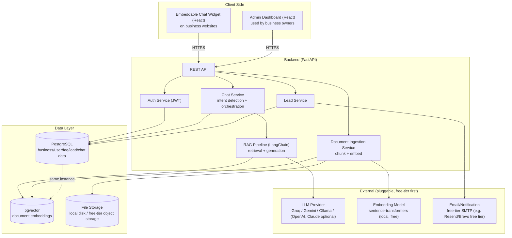

# AgentNexus — Architecture Document

## 1. System Overview

Multi-tenant SaaS. Each business ("tenant") has isolated data (FAQs, documents, leads, conversations) but shares the same application and infrastructure, distinguished by `business_id`.

## 2. Components

### 2.1 Chat Widget (React, embeddable)
- Ships as a small standalone JS bundle loaded via `` (exact CDN/hosting path TBD — not deployed yet).
- Talks only to the public chat API (`/api/chat/*`) and `/api/businesses/{id}/public-settings` — no admin credentials.
- Renders in a Shadow DOM to avoid CSS collisions with the host site.

### 2.2 Admin Dashboard (React)
- Authenticated SPA for business owners.
- Manages FAQs, documents, products/services, branding, leads, conversation history, analytics.

### 2.3 Backend API (FastAPI)
- Stateless REST API, horizontally scalable.
- Routers: `auth`, `businesses`, `faqs`, `documents`, `products`, `chat`, `leads`, `analytics`.
- All authenticated routes resolve `business_id` from the JWT — never trust a client-supplied tenant ID for writes.

### 2.4 RAG Pipeline (Python, `app/rag/pipeline.py`)
1. Document uploaded → text extracted → chunked (`chunk_size`/`chunk_overlap` from settings).
2. Chunks embedded via `sentence-transformers` (local, free) and stored in `document_chunks.embedding_json` (a JSON-encoded float list), scoped by `business_id`.
3. On a chat message: embed the query, pull every chunk for that `business_id` and score them with a pure-Python cosine-similarity loop (`_cosine_similarity` in `pipeline.py`) — **not a pgvector index query**, despite the `pgvector` extension being enabled on the `db` container. This is a known gap: fine at small per-tenant document counts, but a brute-force scan that gets slower as a business's document count grows. FAQs and products are matched separately via simple keyword overlap, not embeddings.
4. Build a grounded prompt from whichever of {chunks above a confidence threshold, matched FAQs, matched products} are non-empty, call the LLM provider.
5. If nothing matches (empty context) → return the business's configured fallback message (or a default) instead of calling the LLM at all — this is the actual "fallback" path today, not a separate rule-based engine.

**Migrating to a real pgvector similarity query** (`ORDER BY embedding <=> query_embedding` with an ivfflat/HNSW index, on a native `VECTOR` column instead of `embedding_json` TEXT) is tracked as follow-up work, not yet done.

### 2.5 LLM Provider Abstraction
- Common interface (`generate(prompt, context) -> text`) with adapters for Groq, Google Gemini, local Ollama, OpenAI, Claude.
- Default to a free-tier provider; business/tenant config can override which provider/model to use.

### 2.6 Lead Capture
- Triggered by explicit form fill or detected "lead" intent mid-conversation.
- Stored in `leads` table; optionally emailed to the business via free-tier transactional email.

### 2.7 Plan Service (`app/services/plan_service.py` + `app/core/plans.py`)
- `app/core/plans.py` is the single source of truth for the four plans (Free/Basic/Business/Growth) — limits and feature flags as plain dataclasses, nothing hardcoded elsewhere.
- `plan_service` answers "is business X allowed to do Y right now": usage counting (websites, conversations this month, documents, products), limit checks (raise `402` when a cap is hit), and feature gating (raise `403` if a plan doesn't include a feature, `501` if the plan includes it but it isn't actually built yet — see `NOT_YET_IMPLEMENTED_FEATURES`).
- Routers call these helpers rather than re-deriving limits themselves, so a plan change in `plans.py` takes effect everywhere at once.
- Plan selection/checkout is on the frontend (`PlanPage.tsx` + `CheckoutModal.tsx`); switching plans is a plain `PATCH /api/businesses/me/plan` call — no payment processor is wired up behind it yet (see `files/FEATURES.md`).

## 3. Multi-Tenancy Approach

- **Shared database, shared schema, tenant column** (`business_id` on every tenant-scoped table) — simplest and cheapest for MVP; can graduate to schema-per-tenant later if a client needs stronger isolation.
- Row-level filtering enforced in the service layer (and optionally Postgres Row-Level Security later).

## 4. API Endpoints (as implemented — see `app/api/*.py` for exact request/response shapes)

### Auth (`/api/auth`) — public
- `POST /register` — create business + owner account, returns JWT
- `POST /login` — returns JWT
- `POST /forgot-password` — always returns the same message whether or not the email exists (no account enumeration); rate-limited 5/hour
- `POST /reset-password` — consumes a one-time token; rate-limited 10/hour

### Business / Admin (`/api/businesses`)
- `GET /{business_id}/public-settings` — public, widget-facing: welcome message + primary color only
- `GET /me`, `PATCH /me` — branding/profile (custom `primary_color` is plan-gated, 403 if not entitled)
- `GET /me/settings`, `PATCH /me/settings` — tone, welcome/fallback message, hours, contact info, languages (plan-gated count), LLM provider/model
- `GET /plans` — public plan catalog (pricing page / upgrade UI)
- `GET /me/plan` — current plan + live usage + resolved feature flags
- `PATCH /me/plan` — switch plans (no payment processor behind this — see `files/FEATURES.md`)
- `PATCH /me/plan/api-access-addon` — toggle the Business-tier "+$12/mo API access" add-on
- `GET /me/api-key`, `POST /me/api-key`, `DELETE /me/api-key` — API key issuance/revocation (gated by `api_access` feature)
- `POST /me/notification-channels` — enable WhatsApp/Instagram; currently always 501s (not built yet), by design

### Websites (`/api/websites`) — the domains a business runs its widget on, capped by plan
- `GET ""`, `POST ""`, `DELETE /{id}`

### FAQs (`/api/faqs`)
- `GET ""`, `POST ""`, `PATCH /{id}`, `DELETE /{id}`

### Documents / knowledge base (`/api/documents`)
- `GET ""`, `POST ""` — file upload, triggers chunk+embed
- `POST /from-url` — fetch and ingest a web page directly (SSRF-guarded — rejects internal/private addresses)
- `DELETE /{id}`

### Products/Services (`/api/products`)
- `GET ""`, `POST ""`, `PATCH /{id}`, `DELETE /{id}`

### Chat (`/api/chat`) — public, widget-facing except where noted
- `POST /message` — `{business_id, session_id, message}` → AI/fallback response, rate-limited
- `GET /conversations` — **authenticated** (dashboard), lists this business's sessions with nested messages
- `DELETE /conversations/{id}` — **authenticated**
- `GET /history/{session_id}`

### Leads (`/api/leads`)
- `GET ""` — authenticated
- `POST ""` — public (widget submits directly), rate-limited
- `PATCH /{id}` — authenticated, status update (new/contacted/won/lost)

### Analytics (`/api/analytics`)
- `GET /summary` — conversation/lead/message counts + top questions; field set varies by plan's `analytics_tier` (basic/standard/advanced)

## 5. Deployment Topology

Domain: **agentnexus.tech**, registered on Hostinger. Marketing site and dashboard/API are split across two different hosting products under that one domain, since they have fundamentally different runtime needs (static files vs. a persistent Python process + database):

- **Marketing site** (`website/`, static Astro build) → `agentnexus.tech` + `www.agentnexus.tech`, served from Hostinger **shared hosting** (`public_html`) — the plan already in place for the domain. No server process, so shared hosting's file-serving-only model is sufficient.
- **Dashboard + API** (`frontend/` + `backend/` + `db`, i.e. all of `docker-compose.yml`) → `app.agentnexus.tech`, served from a **Hostinger VPS** (KVM 1: 1 vCPU / 4GB RAM to start) running `docker compose up -d --build`. Shared hosting can't run a persistent uvicorn process or self-hosted Postgres, hence the separate VPS.
  - DNS: an `A` record for `app` → the VPS's IP is the only routing needed between the two — not a path-based split (`/app`), since that would require both to sit behind one reverse proxy, which shared hosting doesn't allow.
  - `frontend`'s nginx container proxies `/api/*` to the `backend` container over Docker's internal network — same as local dev, unchanged.
  - `CORS_ORIGINS` in production `.env` must include `https://app.agentnexus.tech`.
  - HTTPS is not yet configured (nginx.conf only listens on :80) — adding Caddy or certbot in front is planned, not done.
- **Database**: PostgreSQL + pgvector, self-hosted via the `db` service on the same VPS (not a managed free-tier instance) — see §2.4 above for the caveat that pgvector's actual vector-search capability isn't used by the current retrieval code yet.
- **CI/CD**: not yet set up — deploys are manual (`git pull` + `docker compose up -d --build` on the VPS).
- **Secrets**: a single `.env` at the repo root (git-ignored), read by `app/core/config.py` regardless of which directory the process is started from.
- **VPS purchase status**: not yet provisioned as of this writing — plan is to buy Hostinger KVM 1 and deploy per the steps above once purchased.

## 6. Security Notes

- JWT auth, hashed passwords (`passlib` bcrypt).
- Rate limit the public `/api/chat/message` endpoint to prevent abuse/cost overrun on LLM calls.
- Validate and sandbox uploaded documents (file type/size limits) before parsing.
- CORS restricted to registered business domains for widget embeds where feasible.
